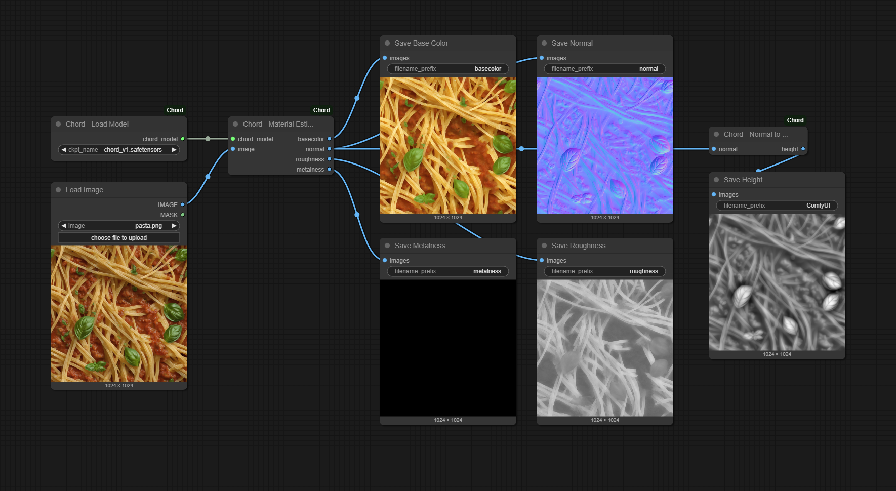

# ComfyUI-Chord

<a href="https://arxiv.org/abs/2509.09952"></a>
<a href="https://ubisoft-laforge.github.io/world/chord/"></a>
<a href="https://github.com/ubisoft/ubisoft-laforge-chord"></a>

ComfyUI custom node for the paper: **Chord: Chain of Rendering Decomposition for PBR Material Estimation from Generated Texture Images**

## Installation

1. Download and install ComfyUI. If you are new to ComfyUI, refer to the original [repository](https://github.com/comfyanonymous/ComfyUI) to get started. **Make sure you have the latest version.**

2. Download the pretrained model **chord_v1.safetensors** from [Hugging Face](https://huggingface.co/Ubisoft/ubisoft-laforge-chord) and place it in the folder **./ComfyUI/models/checkpoints**.

3. Install the custom nodes from the [ComfyUI-Manager](https://github.com/Comfy-Org/ComfyUI-Manager) or manually clone this repository in the custom nodes folder, **with the argument `--recursive`**:

    ```shell
    # Clone the repository
    cd ./ComfyUI/custom_nodes
    git clone --recursive https://github.com/ubisoft/ComfyUI-Chord.git

    # Install dependencies
    ## For Python version
    pip install -r .\ComfyUI-Chord\requirements.txt

    ## Or for Windows portable version
    ..\..\python_embeded\python.exe -s -m pip install -r .\ComfyUI-Chord\requirements.txt
    ```

## Example Workflow

You can load this workflow using the JSON file `example_workflows/chord_image_to_material.json` or by dropping the image in ComfyUI.



## License

This project is released under the **Ubisoft Machine Learning License (Research-Only - Copyleft)**. See the full terms in the [LICENSE](LICENSE) file.

## Citation

If you find our work useful, please consider citing:

```
@misc{ying2025chord,
    title={Chord: Chain of Rendering Decomposition for PBR Material Estimation from Generated Texture Images}, 
    author={Zhi Ying and Boxiang Rong and Jingyu Wang and Maoyuan Xu},
    year={2025},
    eprint={2509.09952},
    archivePrefix={arXiv},
    primaryClass={cs.GR},
    url={https://arxiv.org/abs/2509.09952}, 
}
```

© [2025] Ubisoft Entertainment. All Rights Reserved.